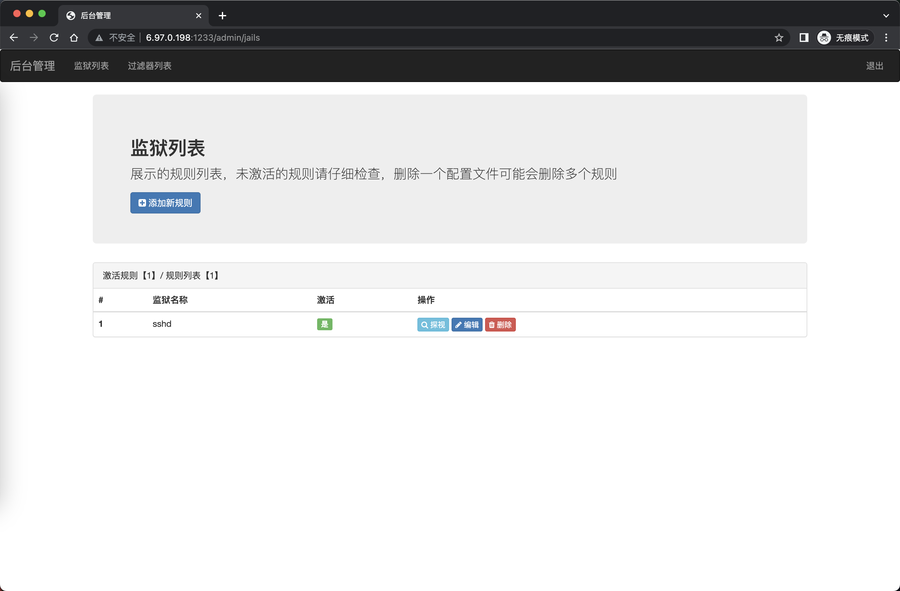
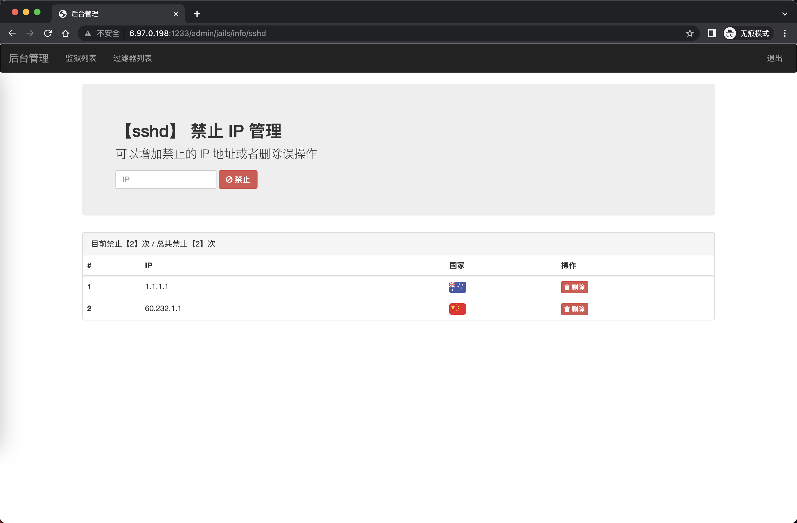
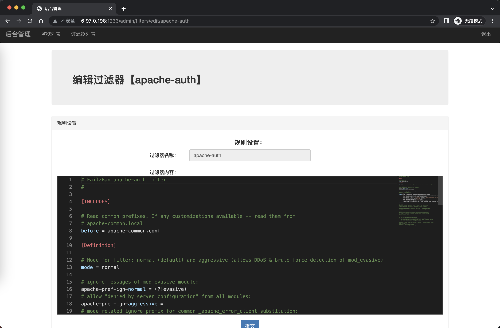

## ⲁⲛⲟⲩⲡ - 阿努比斯

阿努比斯（圣书体：𓇋𓈖𓊪𓅱𓃣，转写：inpw；科普特语：ⲁⲛⲟⲩⲡ，转写：Anoup；古希腊语：Ἄνουβις，转写:Anubis，早期名称:sab）

掌管自动禁止 IP 工作，本管理界面可以对默认 SSH 禁止IP 进行管理， 需要 fail2ban 安装

### 使用教程

#### 开发模式
- 修改 `.env.example` 到 `.env`
- 设置 `IS_MOCK=true` 使用模拟数据，无需真实fail2ban
- 运行 `pnpm dev` 启动开发服务器，默认端口为 `1233`

#### 生产模式
- 推荐使用 Ubuntu 20.04+, 理论上centOS 配置好也可以使用
- 安装fail2ban
- 使用自动化脚本快速设置:
  ```bash
  # 下载项目
  git clone https://github.com/qfdk/anubis.git
  cd anubis
  
  # 使用PM2设置脚本（推荐）
  ./setup-pm2.sh
  ```
- 或手动设置:
  - 修改 `.env.example` 到 `.env`
  - 设置 `IS_MOCK=false` 使用真实fail2ban数据
  - 可以使用打包命令或者直接用PM2启动项目: `pm2 start pm2.json`

### 开发指南

```bash
# 安装依赖
pnpm install

# 开发模式
pnpm dev

# 打包
pnpm build

# 生产环境运行
pnpm start
```

### API访问

Anubis提供了REST API接口，可通过基本认证访问：

```bash
# 使用基本认证获取系统状态
curl http://localhost:1233/api/status \
  -u "admin:admin"

# 获取Fail2Ban统计信息
curl http://localhost:1233/api/fail2ban/stats \
  -u "admin:admin"

# 获取所有禁止的IP
curl http://localhost:1233/api/fail2ban/banned \
  -u "admin:admin"
```

### 可以使用反向代理
- 推荐使用nginx设置反向代理, 1233 端口是在救命的时候使用

### nginx 二级目录反代

*NOTE : 不推荐使用 除非你知道你在干什么*

```bash

location /f2b {
    proxy_set_header Host $host;
    proxy_set_header X-Real_IP $remote_addr;
    proxy_set_header X-Forwarded-For $remote_addr:$remote_port;
    proxy_pass http://localhost:1233/f2b;
    # websocket
    proxy_http_version 1.1;
    proxy_set_header Upgrade $http_upgrade;
    proxy_set_header Connection $connection_upgrade;
}

location ~* ^/f2b/javascripts/(.+\.(js))$ {
    proxy_set_header Host $host;
    proxy_set_header X-Real_IP $remote_addr;
    proxy_set_header X-Forwarded-For $remote_addr:$remote_port;
    proxy_pass http://localhost:1233/f2b/javascripts/$1;
}

location ~* ^/f2b/images/flags/(.+\.(png|jpg|jpeg|gif))$ {
    proxy_set_header Host $host;
    proxy_set_header X-Real_IP $remote_addr;
    proxy_set_header X-Forwarded-For $remote_addr:$remote_port;
    proxy_pass http://localhost:1233/f2b/images/flags/$1;
}

```

### 屏幕截图




