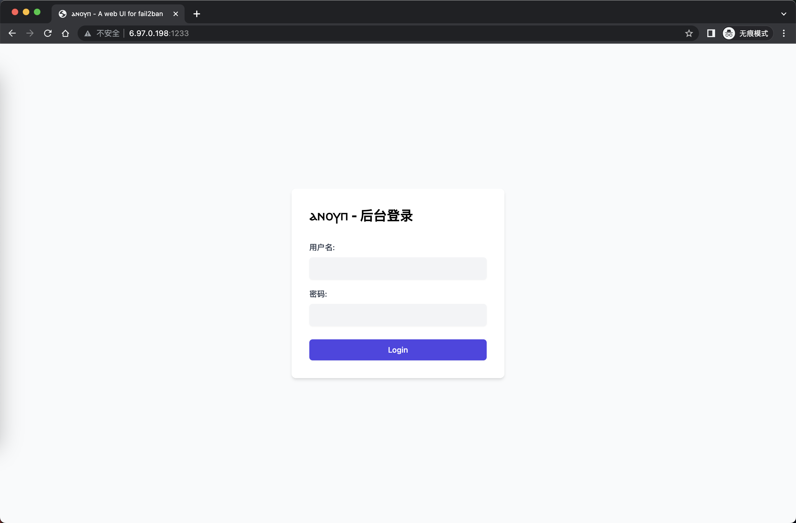

## ⲁⲛⲟⲩⲡ - 阿努比斯

阿努比斯（圣书体：𓇋𓈖𓊪𓅱𓃣，转写：inpw；科普特语：ⲁⲛⲟⲩⲡ，转写：Anoup；古希腊语：Ἄνουβις，转写:Anubis，早期名称:sab）

掌管自动禁止 IP 工作，本管理界面可以对默认 SSH 禁止IP 进行管理， 需要 fail2ban 安装

### 使用教程
- 推荐使用 Ubuntu 20.04+, 理论上centOS 配置好也可以使用
- 安装fail2ban
- 修改 `.env.example` 到 `.env`, 默认配置即可, 默认端口为 `1233`
- 可以使用打包命令或者,直接用PM2启动项目, `pm2 start pm2.json` 当然里面的配置也需要对应的修改,如果不修改 ubuntu 默认可以使用

### 可以使用反向代理
- 推荐使用nginx设置反向代理, 1233 端口是在救命的时候使用

### nginx 二级目录反代

*NOTE : 不推荐使用 除非你知道你在干什么*

```bash

location /f2b {
    proxy_set_header Host $host;
    proxy_set_header X-Real_IP $remote_addr;
    proxy_set_header X-Forwarded-For $remote_addr:$remote_port;
    proxy_pass http://localhost:1233/f2b;
    # websocket
    proxy_http_version 1.1;
    proxy_set_header Upgrade $http_upgrade;
    proxy_set_header Connection $connection_upgrade;
}

location ~* ^/f2b/javascripts/(.+\.(js))$ {
    proxy_set_header Host $host;
    proxy_set_header X-Real_IP $remote_addr;
    proxy_set_header X-Forwarded-For $remote_addr:$remote_port;
    proxy_pass http://localhost:1233/f2b/javascripts/$1;
}

location ~* ^/f2b/images/flags/(.+\.(png|jpg|jpeg|gif))$ {
    proxy_set_header Host $host;
    proxy_set_header X-Real_IP $remote_addr;
    proxy_set_header X-Forwarded-For $remote_addr:$remote_port;
    proxy_pass http://localhost:1233/f2b/images/flags/$1;
}

```

### 屏幕截图




